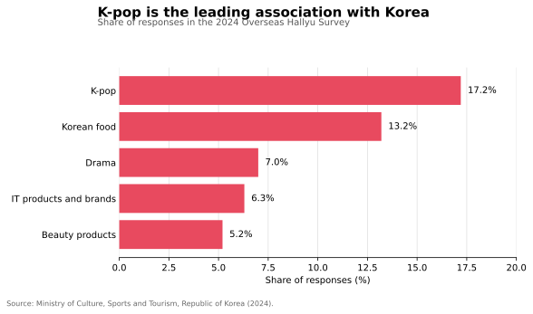

# 🌍 Global Content Insight Sample

## K-pop as a Cross-Cultural Entry Point

> 🎯 **Question:** How could a global content platform turn broad K-pop interest into deeper, locally relevant discovery and community engagement?

`Self-initiated sample` `Public data` `Content strategy` `Experiment design`

## 💡 Why this topic

K-pop is more than a music category. It connects music, performance, fashion, beauty, food, language learning, travel, memes, and highly participatory fan communities. This makes it a useful case for examining how one interest can open multiple content-discovery paths across cultures.

This sample uses public sources only. It does not use or claim access to Rednote user data.

## 🔎 Evidence signals

The 2024 Overseas Hallyu Survey reported that K-pop was the most frequently named association with Korea, at **17.2%**, ahead of Korean food (**13.2%**) and drama (**7.0%**). The association was stronger among teenagers (**23.1%**) and people in their twenties (**20.8%**). The same release reported that **89.4%** of respondents said their interest in Korean cultural content had increased or remained stable year on year.

Spotify reported in 2026 that K-pop generated more than **61 billion streams outside South Korea in 2025**. A separate Spotify case study on RIIZE associated editorial placement, personalised marketing, and exclusive social content with a **40%+ increase in monthly streams**, a **13% increase in monthly listeners**, and a **12% increase in user-generated playlists** over two months.

## 🧠 Interpretation

The evidence supports three observations:

1. **K-pop can act as an entry point rather than an isolated vertical.** Users attracted by music may also discover adjacent interests such as beauty, food, travel, dance, and language.
2. **Younger audiences are especially relevant, but “global fans” should not be treated as one homogeneous group.** Local humour, language, creator norms, and platform habits can change which formats work.
3. **Editorial packaging and participatory formats may deepen engagement.** The RIIZE example does not prove causality, but it provides a useful hypothesis: discovery support plus exclusive and user-participation content can strengthen both reach and active fandom behaviour.

## 🧭 Content opportunity map

| User need | Content format | Localisation question | Success signal |
| --- | --- | --- | --- |
| Fast discovery | Short performance moments, visual hooks, comeback highlights | Which references require explanation locally? | Completion and save rate |
| Context | Beginner guides, member introductions, lyric/cultural explainers | What background knowledge does the market already have? | Follows and return visits |
| Participation | Dance challenges, polls, fan creations, reaction prompts | Which participation style feels natural rather than forced? | Comments and creator participation |
| Adjacent discovery | Beauty, food, fashion, travel, language content | Which adjacent interests are strongest in each market? | Cross-topic click-through |
| Community continuity | Event calendars, recurring series, fandom updates | What cadence matches local viewing habits and time zones? | Repeat engagement |

## 🚀 Operational recommendation

I would test a three-layer content package rather than promoting isolated trending posts:

- 🔥 **Discover:** low-context, visually strong content that helps a new user understand why a topic matters within seconds.
- 💡 **Understand:** concise explainers and local-language context that reduce cultural and knowledge barriers.
- 🤝 **Participate:** prompts, polls, creator remixes, and fan-made collections that give users a clear role in the community.

For each market, I would keep the topic constant but adapt the hook, explanation depth, creator mix, and participation prompt. Results should be compared through controlled tests rather than assuming one global format will transfer unchanged.

## 🧪 Proposed test

**Hypothesis:** A localised three-layer package produces stronger repeat engagement than a single translated trend post.

**Test design:**

- Select one K-pop topic and create two variants for each target market.
- Variant A: direct translation of a central content package.
- Variant B: localised hook, context, creator mix, and call to participate.
- Compare completion, saves, comments, creator participation, follow-on discovery, and seven-day return behaviour.
- Review qualitative comments to identify cultural misunderstandings or emerging adjacent interests.

## ⚠️ Limitations

- Public survey and streaming data describe broad interest, not Rednote-specific behaviour.
- The Spotify artist case is observational and should not be treated as causal proof.
- Market-level recommendations would require local user data, creator interviews, and platform experiments.

## 🔗 Sources

- [Ministry of Culture, Sports and Tourism, Republic of Korea — 2024 Overseas Hallyu Survey](https://www.mcst.go.kr/english/policy/pressView.jsp?pSeq=383)
- [KOFICE — Overseas Hallyu Survey programme](https://www.kofice.or.kr/eng/conts/view.do?mnucd=315)
- [Spotify — What 20 Years of Data Reveals About Our Listeners](https://newsroom.spotify.com/2026-04-23/spotify-20-data-listening-trends/)
- [Spotify — RADAR Korea and RIIZE](https://newsroom.spotify.com/2024-06-26/radar-korea-invites-fans-inside-the-vibrant-world-of-riize-in-honor-of-the-k-pop-groups-first-mini-album-riizing/)

Data accessed September 2026. All strategic recommendations are my interpretation of the cited public evidence.

[← Back to portfolio home](../../README.md)
